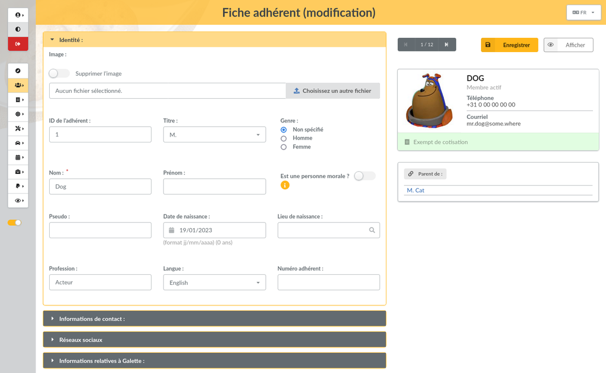

<!--
Este archivo README esta generado automaticamente<https://github.com/YunoHost/apps/tree/master/tools/readme_generator>
No se debe editar a mano.
-->

# Galette para Yunohost

[](https://ci-apps.yunohost.org/ci/apps/galette/)


[](https://install-app.yunohost.org/?app=galette)

*[Leer este README en otros idiomas.](./ALL_README.md)*

> *Este paquete le permite instalarGalette rapidamente y simplement en un servidor YunoHost.*  
> *Si no tiene YunoHost, visita [the guide](https://yunohost.org/install) para aprender como instalarla.*

## Descripción general

Galette is a membership management web application towards non profit organizations.

### Features

- Member management
- Management of contributions and transactions
- Management of groups and managers
- Imports and exports (open formats)
- Increased accessibility (use and compliance with web standards)
- Configuration of cards and lists
- Addition of dynamic fields to members, contributions and transactions files
- Plugin support


**Versión actual:** 1.1.4~ynh1

**Demo:** <https://demo.galette.eu/login>

## Capturas



## Documentaciones y recursos

- Sitio web oficial: <https://www.galette.eu>
- Documentación administrador oficial: <https://doc.galette.eu/fr/master/>
- Repositorio del código fuente oficial de la aplicación : <https://github.com/galette/galette>
- Catálogo YunoHost: <https://apps.yunohost.org/app/galette>
- Reportar un error: <https://github.com/YunoHost-Apps/galette_ynh/issues>

## Información para desarrolladores

Por favor enviar sus correcciones a la [rama `testing`](https://github.com/YunoHost-Apps/galette_ynh/tree/testing).

Para probar la rama `testing`, sigue asÍ:

```bash
sudo yunohost app install https://github.com/YunoHost-Apps/galette_ynh/tree/testing --debug
o
sudo yunohost app upgrade galette -u https://github.com/YunoHost-Apps/galette_ynh/tree/testing --debug
```

**Mas informaciones sobre el empaquetado de aplicaciones:** <https://yunohost.org/packaging_apps>
