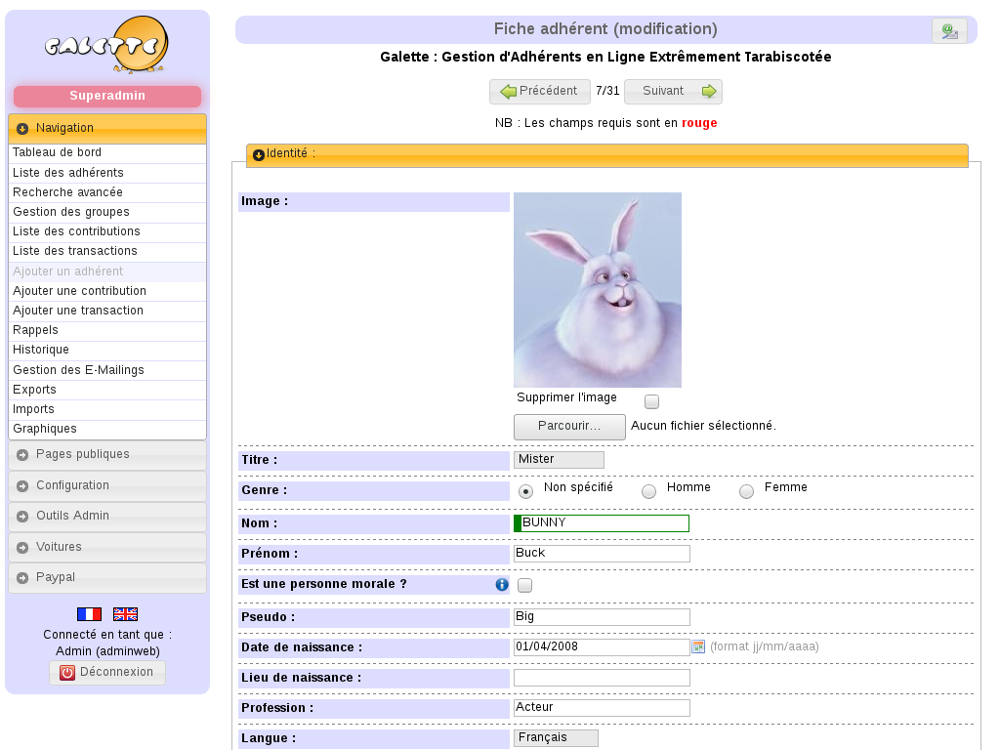

<!--
N.B.: Questo README è stato automaticamente generato da <https://github.com/YunoHost/apps/tree/master/tools/readme_generator>
NON DEVE essere modificato manualmente.
-->

# Galette per YunoHost

[](https://dash.yunohost.org/appci/app/galette)  

[](https://install-app.yunohost.org/?app=galette)

*[Leggi questo README in altre lingue.](./ALL_README.md)*

> *Questo pacchetto ti permette di installare Galette su un server YunoHost in modo semplice e veloce.*  
> *Se non hai YunoHost, consulta [la guida](https://yunohost.org/install) per imparare a installarlo.*

## Panoramica

Galette is a membership management web application towards non profit organizations.

### Features

- Member management
- Management of contributions and transactions
- Management of groups and managers
- Imports and exports (open formats)
- Increased accessibility (use and compliance with web standards)
- Configuration of cards and lists
- Addition of dynamic fields to members, contributions and transactions files
- Plugin support


**Versione pubblicata:** 1.1.5.2~ynh1

**Prova:** <https://demo.galette.eu/login>

## Screenshot



## Documentazione e risorse

- Sito web ufficiale dell’app: <https://www.galette.eu>
- Documentazione ufficiale per gli amministratori: <https://doc.galette.eu/fr/master/>
- Repository upstream del codice dell’app: <https://github.com/galette/galette>
- Store di YunoHost: <https://apps.yunohost.org/app/galette>
- Segnala un problema: <https://github.com/YunoHost-Apps/galette_ynh/issues>

## Informazioni per sviluppatori

Si prega di inviare la tua pull request alla [branch di `testing`](https://github.com/YunoHost-Apps/galette_ynh/tree/testing).

Per provare la branch di `testing`, si prega di procedere in questo modo:

```bash
sudo yunohost app install https://github.com/YunoHost-Apps/galette_ynh/tree/testing --debug
o
sudo yunohost app upgrade galette -u https://github.com/YunoHost-Apps/galette_ynh/tree/testing --debug
```

**Maggiori informazioni riguardo il pacchetto di quest’app:** <https://yunohost.org/packaging_apps>
